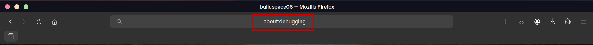
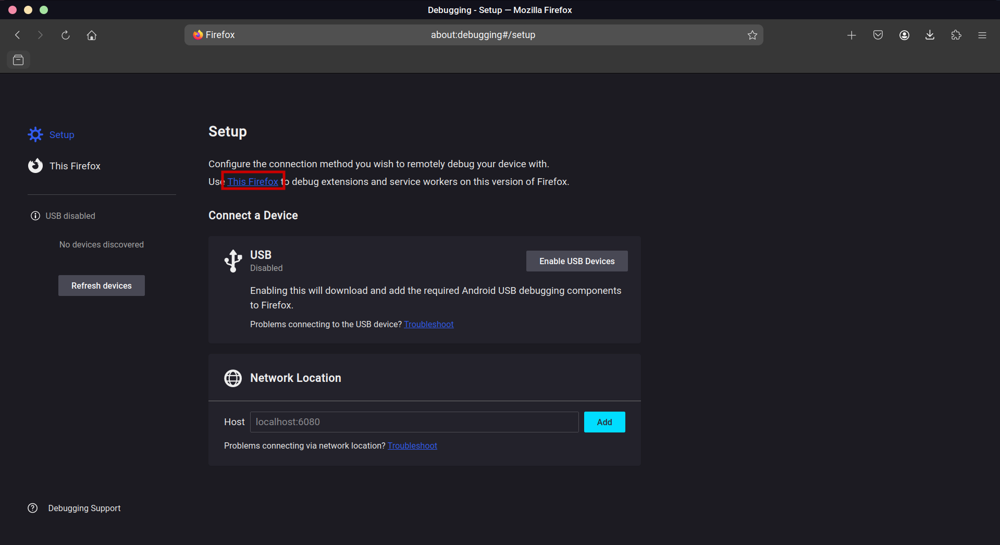
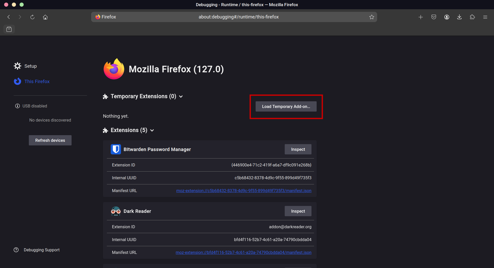
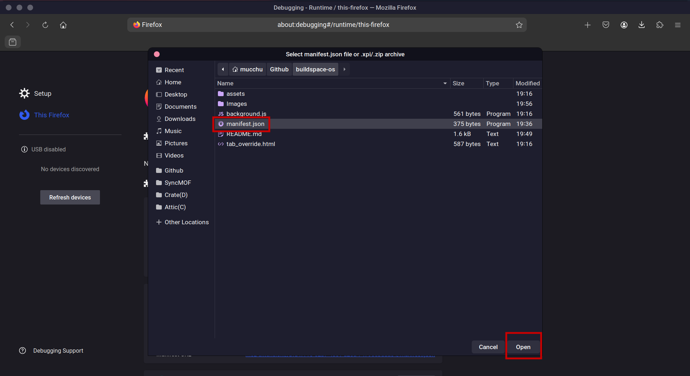
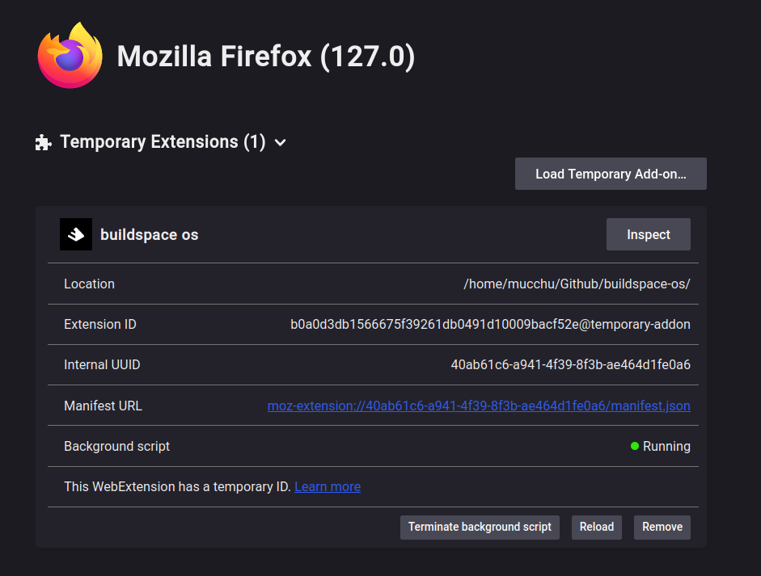

# buildspace os

## setup
### you don't need to write any code or know how to code to set this up. It will take 2 mins max — promise

<!-- **we even made a 2 min vid for you** -->

<!-- [installing buildspcae os](https://github.com/buildspace/buildspace-os/assets/13204620/c19da4b4-1266-4772-ba4e-0fdd795df9f4) -->

### The original extension has been modified to work on Firefox browsers

### 1. download
click the green "Code" button and select "Download ZIP". make sure to extract the download in a safe spot! 

### 2. turn on Developer mode
Type `about:debugging` in the url bar and hit enter. 

once you get there you'll see "This Firefox" link, click on that to move forward 

### 3. add the app to your browser
Now click on the Load Temporary Add-on...
 

once you click it should ask you select the extension file 

Navigate to the downloaded extension foder and select the `manifest.json` file and click open.

Congratulations! You did it! you must now see the extension loaded and running, just like this:

### 4. open a new tab
now you can see this thing in action! Open a new tab and you'll notice that there is a prompt saying that the page was changed by the buildspace os extension. **Make sure to select keep changes or it will not work.** 

## got questions?
for any questions please send an email to support@buildspace.so
